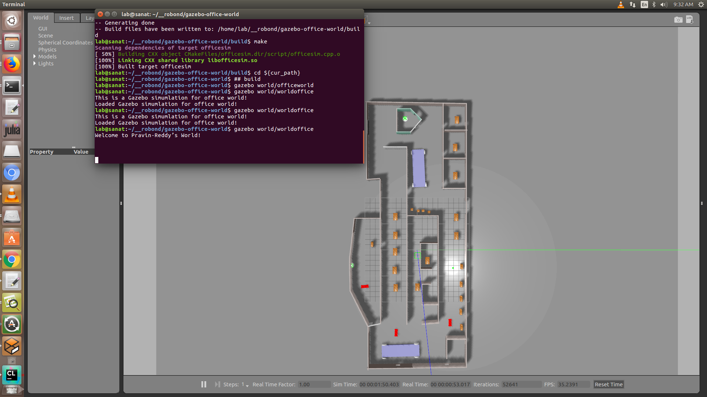
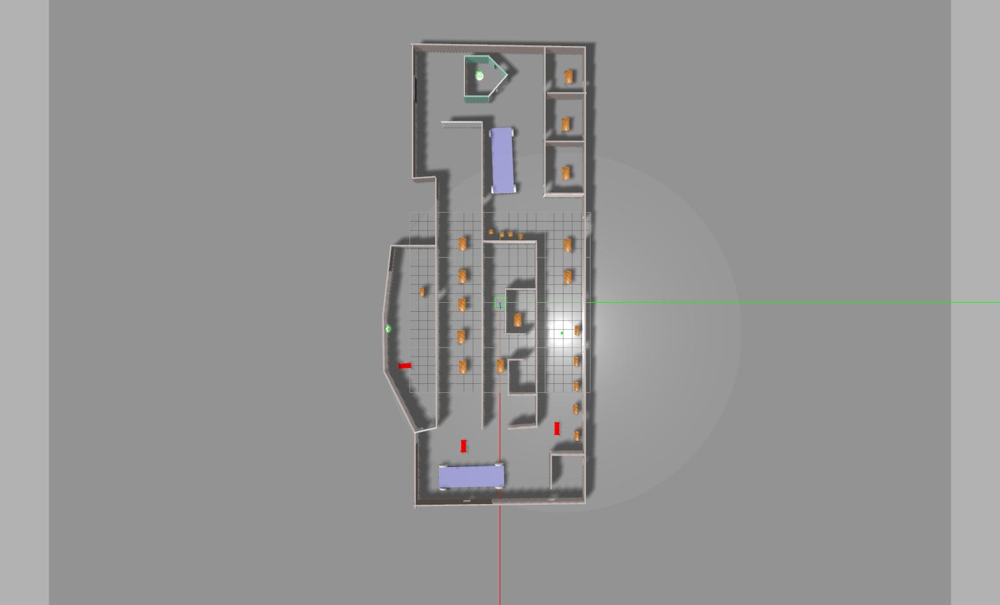
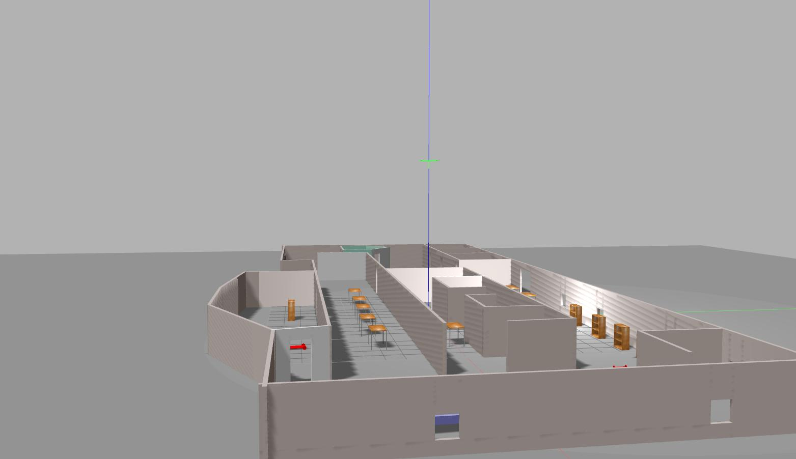
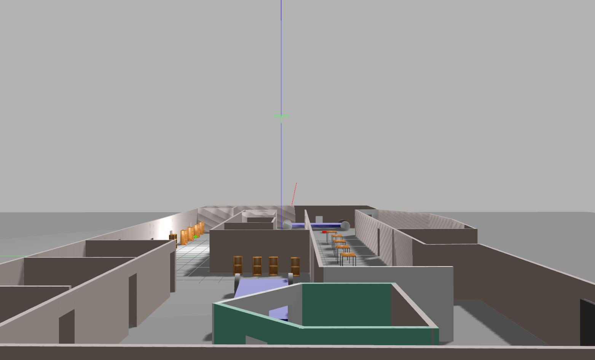
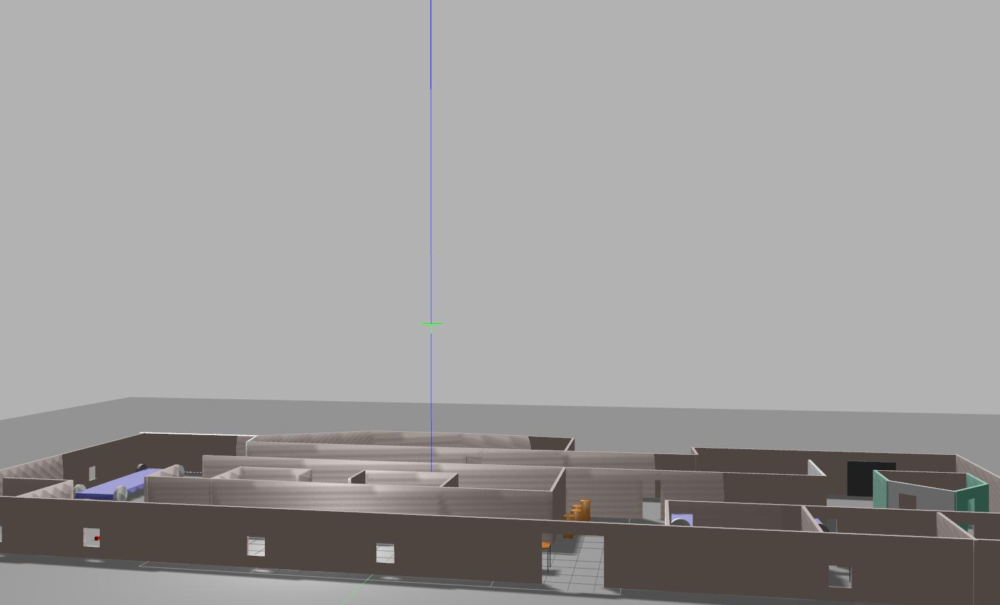

[](https://www.udacity.com/robotics)

# RoboND-myrobot
The **myrobot** lab part of RoboND Gazebo Basics lesson. The purpose of this lab is to learn how to build a two-wheeled robot model with the Model Editor tool in Gazebo. Include this model in an empty Gazebo World. And, finally write a plugin to interact with this world.  

### Directory Structure
```
    .gazebo-office-world                           # gazebo-office-world lab main folder 
    ├── images                         # Code output image                   
    │   ├── output_0.png
    │   ├── output_1.jpg
    │   ├── output_2.jpg
    │   ├── output_3.jpg
    │   ├── output_4.jpg
    │   ├── floor_plan.png
    ├── model                          # Model files of the two-wheeled robot
    │   ├── big_cart
    │   │   ├── model.config
    │   │   ├── model.sdf
    │   ├── cart
    │   │   ├── model.config
    │   │   ├── model.sdf
    │   ├── officesim
    │   │   ├── model.config
    │   │   ├── model.sdf
    │   ├── robot
    │   │   ├── model.config
    │   │   ├── model.sdf
    │   ├── test
    │   │   ├── model.config
    │   │   ├── model.sdf
    ├── script                         # Gazebo World plugin C++ script      
    │   ├── officesim.cpp
    ├── world                          # Gazebo main World empty scene
    │   ├── worldoffice
    ├── CMakeLists.txt                 # Link libraries 
    └──                              
```

### Steps to launch the simulation

#### Step 1 Update and upgrade the Workspace image
```sh
$ sudo apt-get update
$ sudo apt-get upgrade -y
```

#### Step 2 Clone the lab folder in /home/workspace/
```sh
$ cd /home/workspace/
$ git clone https://github.com/udacity/RoboND-myrobot myrobot
```

#### Step 3 Compile the code
```sh
$ cd /home/workspace/myrobot/
$ mkdir build
$ cd build/
$ cmake ../
$ make
```

#### Step 4 Add the library path to the Gazebo plugin path  
```sh
$ export GAZEBO_PLUGIN_PATH=${GAZEBO_PLUGIN_PATH}:/home/workspace/myrobot/build
```

#### Step 5 Run the Gazebo World file  
```sh
$ cd /home/workspace/myrobot/world/
$ gazebo myworld
```

### Output
The hello world message and the two-wheeled robot inside a Gazebo World should both launch as follow: 












    
 
 
 
 ## Project Rubric  
 ### 1. Basic Requirements  
 #### 1.1 Does the project include a world directory containing the Gazebo world file, a model directory containing a structure and an object model files, a script directory containing the C++ plugin code, and a CMakeLists.txt file?  
 Comleted.  
 ### 2. Building  
 #### 2.1 Does the project include a house with walls?  
 Comleted.  
 ### 3. Modeling  
 #### 3.1 Does the project include an object built using the Model Editor?  
 Comleted.  
 ### 4. Gazebo World  
 #### 4.1 Does the project contain a Gazebo world with multiple models?  
 Comleted.  
 ### 5. World Plugin  
 #### 5.1 Does the project contain a C++ world plugin?  
 Comleted.  

